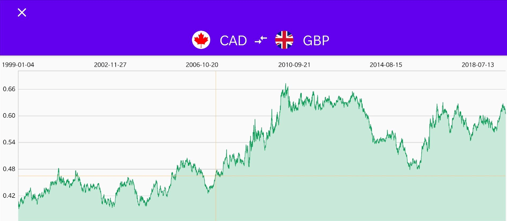
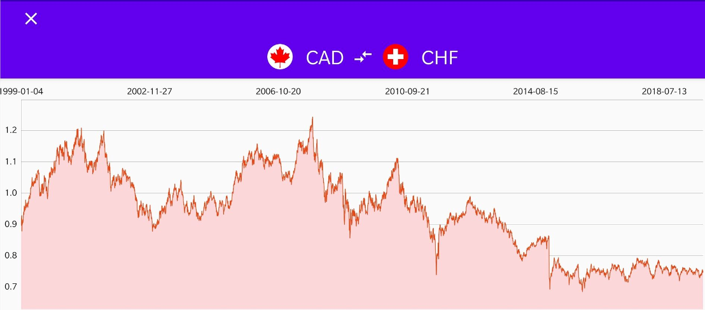

# CurrencyConverter
A native Currency Converter application implemented in Java that currently supports any currency that is available on the [European Central Bank's](https://www.ecb.europa.eu/stats/policy_and_exchange_rates/euro_reference_exchange_rates/html/index.en.html) web service.

## Getting Started
To clone this repository, you need to have [GIT](https://git-scm.com) installed on your computer. From your command line:
```
$ git clone https://github.com/sammy9867/CurrencyConverter.git
```
## Built With
* Retrofit
* ViewModel
* LiveData
* Glide
* CircleImageView
* MPAndroidChart
* FancyToast

## Features
* Select a base currency and enter the amount to check the exchange rates.
* List of different currency exchange rates that are currently available with clear and concise information.
* A historical line chart comparison between the base and the selected currency dated back from 4th January, 1999.

## Screenshots





## Additional information
* You can check [this](https://github.com/exchangeratesapi/exchangeratesapi) out for the official ExchangeRates API.

## Author
* **Samuel Menezes** - [sammy9867](https://github.com/sammy9867)
